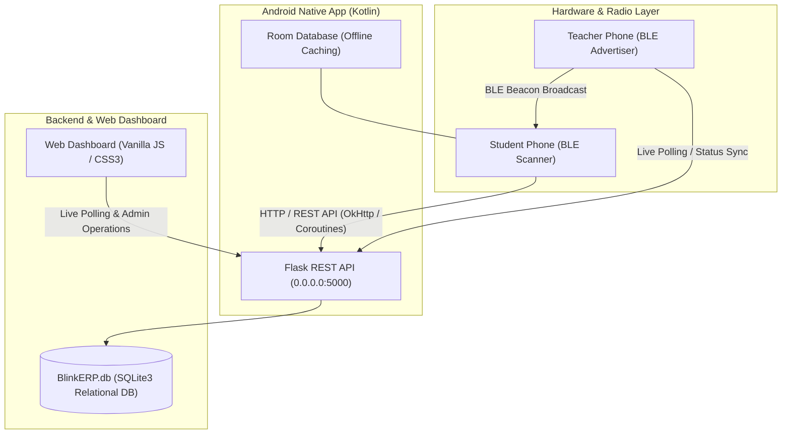

# 🚀 BlinkERP — Next-Gen Smart Attendance & Academic ERP

<div align="center">


[](https://developer.android.com)
[](https://flask.palletsprojects.com)
[](https://www.bluetooth.com)
[](https://sqlite.org)

**BlinkERP** is an institutional-grade, zero-hardware classroom attendance & academic management ERP suite. It combines **Bluetooth Low Energy (BLE)** proximity detection with an enterprise **Web Dashboard** and a high-performance **Android application** for instant, tamper-proof attendance, study material sharing (Class Notes & PYQs), and student analytics.

[Features](#-key-features) • [System Architecture](#-system-architecture) • [Quick Start](#-quick-start) • [Tech Stack](#-technology-stack) • [Role Matrix](#-role-matrix)

</div>

---

## 🌟 Key Features

### 📡 1. Zero-Hardware BLE Auto-Attendance
- **Teacher Broadcast Beacon:** Teachers start a class on their Android phone with one tap. The phone turns into a BLE GATT advertising peripheral.
- **Instant Student Auto-Detection:** Students tap "Join Class" — their phones scan for the teacher's cryptographic BLE beacon and submit verified attendance within 2 seconds.
- **Anti-Proxy & Signal Range Verification:** Uses RSSI proximity filtering and BLE hardware address tracking to eliminate proxy attendance.
- **Triple-Screen Real-Time Sync:** Attendance updates simultaneously across:
  1. Teacher's Android phone (live detected count + student names list)
  2. Student's Android phone (verified checkmark + subject statistics)
  3. Web / Projector Dashboard (live real-time student grid)

### 📚 2. Centralized Academic Hub (Notes & PYQs)
- **Teacher Notes Portal:** Teachers upload lecture notes, slides, and assignment PDFs categorized by Branch, Year, Section, and Subject.
- **Student Download Library:** Students access class notes filtered directly for their branch/section with offline caching.
- **Integrated PYQ Archive:** Instant access to curated Previous Year Question (PYQ) end-sem and mid-sem exam papers directly linked via cloud drive and download storage.

### 📊 3. Student Analytics & Bunk Predictor
- **Smart Attendance Health Score:** Real-time percentage tracking with color-coded safety badges (Green: Safe, Yellow: Warning, Red: Critical < 75%).
- **Bunk Calculator ("Safe to Bunk"):** Automatically calculates how many classes a student can safely miss or how many consecutive classes they must attend to restore a 75%+ eligibility threshold.

### 🛡️ 4. Enterprise Admin Control & Security
- **Department & Section Management:** Hierarchical data architecture supporting multi-discipline universities (CSE, CSE AIML, ECE, ME, CE, IT).
- **Master User Management:** Admin can add, update passwords, or delete teachers, students, and system credentials.
- **Flexible Network Configuration:** Built-in dynamic IP configuration and 1-tap "Save & Test" connectivity ping for seamless LAN and mobile hotspot hosting.

---

## 🏛 System Architecture



---

## 🚀 Quick Start Guide

### Prerequisites
- **Python:** 3.10 or higher
- **Android Studio / JDK:** JDK 17 (recommended: `jbr-17`)
- **Android Device:** Android 8.0+ (API 26+) with Bluetooth Low Energy support

---

### 1. Start the Flask Backend Server
```powershell
# Navigate to the backend directory
cd c:\Users\hp\smart_attend_web

# Install dependencies
pip install -r requirements.txt

# Launch the server
python Api.py
```
> The server will start on `http://0.0.0.0:5000` and automatically bind to your local Wi-Fi / LAN IP.

---

### 2. Expose Server Online (Cloudflare Tunnel - Never Blocked)
To share access with friends/students across any network (College Wi-Fi, Jio/Airtel 4G, Hotspot):
```powershell
# Open a second terminal and run:
cd c:\Users\hp\smart_attend_web
.\cloudflared.exe tunnel --url http://127.0.0.1:5000
```
> ✅ **Live Public Cloud URL:** `https://spirit-represents-promoted-promptly.trycloudflare.com`  
> *(This URL is pre-configured in the Android app and can be updated anytime from the app's Server URL box)*

---

### 3. Access the Web Dashboard
Open any modern web browser on laptop or phone:
```
# Local:
http://localhost:5000

# Live Cloud ERP:
https://spirit-represents-promoted-promptly.trycloudflare.com
```
- **Admin Login:** Role: `Admin` | Password: `9999`
- **Teacher Login:** Role: `Teacher` (e.g., `dhani` / `1234`)
- **Student Login:** Role: `Student` (e.g., `mayank` / `1234` or `yash` / `1234`)

---

### 4. Build & Install the Android App
The pre-compiled production APK is ready at:
```
android_app/app/build/outputs/apk/debug/app-debug.apk
```

To rebuild the APK from source:
```powershell
cd android_app
$env:JAVA_HOME="C:\Users\hp\.jdks\jbr-17.0.14"
.\gradlew.bat assembleDebug --no-daemon
```

> 📡 **Default Server URL in App:** `https://spirit-represents-promoted-promptly.trycloudflare.com` (Editable on login screen)

---

## 📱 Roles & Capabilities

| Feature | Student | Teacher | Administrator |
| :--- | :---: | :---: | :---: |
| **BLE Attendance** | Auto Join Class | Broadcast & Manage Session | Audit Live Feeds |
| **Class Notes** | View & Download | Upload & Manage | View & Moderate |
| **PYQ Papers** | Access All Folders | Access & Upload | Full CRUD Access |
| **Attendance Analytics** | Personal Bunk Calculator | Class-wise Summary | Institute-wide Metrics |
| **User & Roster Control** | Edit Profile | View Roster | Create/Edit/Delete Users |
| **Server Network Config** | Dynamic IP Switcher | Dynamic IP Switcher | Full Backend Control |

---

## 🛠 Technology Stack Highlights

| Component | Technologies Used |
| :--- | :--- |
| **Mobile Client** | Kotlin, MVVM, Android Jetpack, Room ORM, OkHttp3, ViewPager2, Material Components 3 |
| **Radio / Hardware** | Bluetooth Low Energy (BLE), GATT Server Advertising, BluetoothLeScanner |
| **Backend Engine** | Python 3.10+, Flask REST API, Flask-CORS, Werkzeug, SQLite3 WAL Mode |
| **Web Frontend** | HTML5 Semantic, Modern CSS3 (Variables, Flex/Grid, Glassmorphism), Vanilla ES6+ JS |
| **Security & Auth** | SHA-256 Hashing, Android 12+ Fine Location & Bluetooth Runtime Permissions |

👉 **For the complete technical breakdown of every library, architecture pattern, and protocol, see [TECH_STACK.md](./TECH_STACK.md).**

---

## 📄 License
This project is licensed under the MIT License — designed for enterprise hackathons, colleges, and scalable ERP deployments.