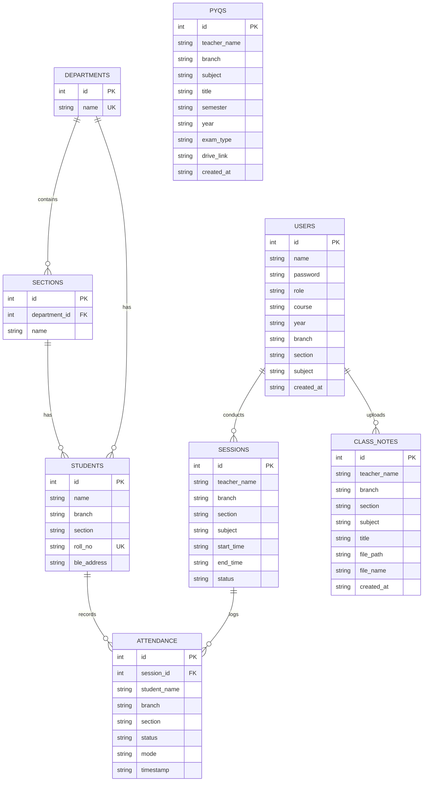

# 🛠️ BlinkERP — Comprehensive Technology Stack & Architectural Specification

This document provides an exhaustive, production-level breakdown of all technologies, frameworks, libraries, protocols, database schemas, and architectural patterns employed across the **BlinkERP** platform.

---

## 📑 Table of Contents
1. [Platform Overview](#1-platform-overview)
2. [Android Mobile Client Stack](#2-android-mobile-client-stack)
3. [Backend Server & REST API Architecture](#3-backend-server--rest-api-architecture)
4. [Database Architecture & Data Models](#4-database-architecture--data-models)
5. [Wireless & Hardware Protocol (BLE)](#5-wireless--hardware-protocol-ble)
6. [Web Dashboard & Frontend Architecture](#6-web-dashboard--frontend-architecture)
7. [Security & Permissions Framework](#7-security--permissions-framework)
8. [DevOps, Tooling & Build System](#8-devops-tooling--build-system)

---

## 1. Platform Overview

BlinkERP is architected as a **distributed, triple-tier hybrid ecosystem**:
- **Edge Tier (Mobile):** Native Android app providing Bluetooth Low Energy (BLE) hardware advertising (Teacher) and high-speed BLE beacon scanning (Student).
- **Core Tier (Server):** Python Flask REST micro-service with high-concurrency connection handling and real-time transaction processing.
- **Storage Tier (Database):** Dual-layer persistence: SQLite3 relational database on the server, paired with Android Room ORM for offline synchronization and local caching.
- **Presentation Tier (Web):** Modern SPA dashboard providing real-time auditorium/classroom projection, administrative user management, and institutional analytics.

---

## 2. Android Mobile Client Stack

### 2.1 Language & Compiler Environment
- **Primary Language:** Kotlin (`1.9.0`)
- **Bytecode Target:** Java 17 (JVM 17 compatible with Modern Android Toolchain)
- **Minimum SDK (minSdkVersion):** API 26 (Android 8.0 Oreo) — Ensures universal hardware BLE support
- **Target SDK (targetSdkVersion):** API 34 (Android 14 Upside Down Cake)
- **Compile SDK (compileSdkVersion):** API 34

### 2.2 Architectural Pattern
- **Pattern:** **MVVM (Model-View-ViewModel) + Repository Pattern**
- **Clean Architecture Principles:**
  - **Data Layer:** Room DAOs (`UserDao`, `SessionDao`, `AttendanceDao`, `NoteDao`, `PyqDao`) + `ApiService` HTTP client.
  - **Repository Layer:** `MainRepository` acting as a single source of truth (SSOT) managing local Room database and remote network synchronization.
  - **UI / Presentation Layer:** Android Activities (`DashboardActivity`, `TeacherActivity`, `StudentActivity`, `LoginActivity`, `RegisterActivity`, `AdminActivity`) and Fragments (`HomeFragment`, `AnalyticsFragment`, `NotesFragment`, `PyqFragment`, `ProfileFragment`, `StudentsFragment`).
- **Reactive State Management:** Kotlin Coroutines (`kotlinx.coroutines`) + StateFlow (`MutableStateFlow`) + LiveData for lifecycle-safe reactive UI updates.

### 2.3 Android Jetpack & Framework Components
| Library / Component | Version / Artifact | Purpose |
| :--- | :--- | :--- |
| **AndroidX Core KTX** | `androidx.core:core-ktx:1.12.0` | Kotlin language extensions for standard Android APIs |
| **AppCompat** | `androidx.appcompat:appcompat:1.6.1` | Backward-compatible implementation of UI widgets |
| **Material Components 3** | `com.google.android.material:material:1.11.0` | Material Design cards, buttons, dialogs, bottom navigation |
| **ConstraintLayout** | `androidx.constraintlayout:constraintlayout:2.1.4` | High-performance, flat-hierarchy UI layouts |
| **Room Database ORM** | `androidx.room:room-runtime:2.6.1`, `room-ktx:2.6.1` | Local SQLite abstraction, entity mapping, and offline caching |
| **Room KAPT Compiler** | `androidx.room:room-compiler:2.6.1` | Compile-time annotation processor for type-safe database queries |
| **Navigation Component** | `androidx.navigation:navigation-fragment-ktx:2.7.7`, `ui-ktx:2.7.7` | Type-safe declarative fragment navigation graph |
| **Lifecycle & Coroutines** | `androidx.lifecycle:lifecycle-runtime-ktx:2.7.0`, `viewmodel-ktx:2.7.0` | Coroutine scopes tied to UI lifecycle (`lifecycleScope`) |
| **ViewPager2** | `androidx.viewpager2:viewpager2:1.0.0` | Smooth horizontal swiping for feature banners and carousel cards |
| **CardView** | `androidx.cardview:cardview:1.0.0` | Rounded corners, card elevation, and surface backdrops |

### 2.4 Mobile Networking & Hardware Interop
| Dependency | Coordinates | Function |
| :--- | :--- | :--- |
| **OkHttp 3** | `com.squareup.okhttp3:okhttp:4.12.0` | Fast HTTP/REST communication, connection pooling, and timeouts |
| **OkHttp Logging Interceptor** | `com.squareup.okhttp3:logging-interceptor:4.12.0` | Network request/response payload debugging |
| **Android BLE APIs** | `android.bluetooth.*`, `android.bluetooth.le.*` | Native Bluetooth Low Energy GATT advertiser & scanner |

---

## 3. Backend Server & REST API Architecture

### 3.1 Runtime & Framework
- **Runtime:** Python `3.10+` / `3.11+` / `3.12+`
- **Web Microframework:** **Flask (`3.0.x`)**
- **CORS Middleware:** **Flask-CORS (`4.0.x`)** — Configured for universal cross-origin requests from web dashboards and mobile clients
- **WSGI Utility:** Werkzeug (`3.0.x`) — Multi-part file upload processing, secure file routing, and URL resolution
- **Socket Binding:** `0.0.0.0:5000` (dual-stack: binds to localhost, Wi-Fi LAN, and mobile hotspot IP simultaneously)

### 3.2 Key API Endpoints Specification

#### Authentication & User Registry
- `POST /api/register` — Registers new Teacher or Student with course, year, branch, and section; performs case-insensitive upsert.
- `POST /api/login` — Authenticates user via name, SHA-256 hashed password, and role; returns session token and profile record.
- `GET /api/admin/users` — Queries user accounts with optional query parameter filters (`role`, `course`, `year`, `branch`, `section`).
- `POST /api/admin/users` — Administrative user provisioning.
- `POST /api/admin/users/<id>/password` — Administrative instant password reset.
- `DELETE /api/admin/users/<id>` — User de-provisioning.

#### Real-Time Attendance Sessions
- `POST /api/start_session` — Teacher begins a class period (`teacher_name`, `branch`, `section`, `subject`); generates new `session_id`.
- `POST /api/end_session` — Concludes an active class session and closes attendance window.
- `POST /api/mark` — Records student attendance verification via BLE proximity (`student_name`, `branch`, `section`, `mode="Auto"`).
- `GET /api/session/<id>/live` — Sub-second polling endpoint returning live session status, present count, and attendee list.
- `GET /api/sessions` — Lists active and archived class sessions with teacher filtering.

#### Academic Repository (Notes & PYQ Papers)
- `POST /api/notes/upload` — Multipart form upload for PDF/PPTX lecture notes with metadata (`teacher_name`, `branch`, `section`, `subject`, `title`).
- `GET /api/notes` — Retrieves filtered lecture notes with flexible fallback matching (`branch="All"` or specific branch).
- `GET /api/notes/download/<id>` — Streaming binary download of stored lecture documents.
- `GET /api/pyqs` — Curated Previous Year Question papers categorized by Department, Semester, Year, and Exam Type (Mid-Sem / End-Sem) with cloud drive links.

---

## 4. Database Architecture & Data Models

### 4.1 Storage Engine
- **Engine:** SQLite 3 (`BlinkERP.db`)
- **Concurrency Mode:** WAL (Write-Ahead Logging) enabled for simultaneous multi-threaded read/write performance.
- **Integrity Enforcement:** `PRAGMA foreign_keys = ON;` strictly enforced.
- **Password Encryption:** SHA-256 cryptographic digest hashing (`hashlib.sha256`).

### 4.2 Relational Entity Schema



---

## 5. Wireless & Hardware Protocol (BLE)

### 5.1 Protocol Architecture
BlinkERP implements a **zero-hardware, asymmetric Bluetooth Low Energy protocol** operating in the 2.4 GHz ISM band:

```
[Teacher Android Phone]                               [Student Android Phone]
   (BLE Peripheral)                                      (BLE Central)
          │                                                    │
          ├── 1. BLE Advertising Beacon Broadcast ────────────>│
          │      • Service UUID: 0000FEAA-0000-...             │ (Auto-scans with
          │      • Device Name: "TEACHER:<Name>"               │  SCAN_MODE_LOW_LATENCY)
          │      • TxPowerLevel: HIGH                          │
          │                                                    ├── 2. RSSI & Proximity Check
          │                                                    │      • Filters signal strength
          │                                                    │
          │                                                    ├── 3. Submit Attendance
          │                                                    │      (HTTP POST /api/mark)
          │                                                    │           │
          │                                                    │           ▼
          │<───────── 4. Live Session Poll (2s loop) ──────────┼───── [Flask Server]
          │           (Receives verified attendee name)        │      (Updates DB & Live Feed)
```

### 5.2 Teacher Side (BLE Advertiser / Peripheral)
- **Core Class:** `android.bluetooth.le.BluetoothLeAdvertiser`
- **Mode:** `AdvertiseSettings.ADVERTISE_MODE_LOW_LATENCY`
- **Tx Power Level:** `AdvertiseSettings.ADVERTISE_TX_POWER_HIGH`
- **Connectability:** `setConnectable(false)` (Pure broadcast mode — minimizes battery drain and eliminates Bluetooth pairing prompts)
- **Payload:**
  - `setIncludeDeviceName(true)`
  - Custom 16-bit Service UUID: `0000FEAA-0000-1000-8000-00805F9B34FB` (standards-compliant Eddystone-compatible space)
  - Broadcast identifier format: `TEACHER:<TeacherName>`

### 5.3 Student Side (BLE Scanner / Central)
- **Core Class:** `android.bluetooth.le.BluetoothLeScanner`
- **Scan Mode:** `ScanSettings.SCAN_MODE_LOW_LATENCY`
- **Callback Type:** `ScanSettings.CALLBACK_TYPE_ALL_MATCHES`
- **Proximity Filter:** Configured RSSI proximity threshold (`RSSI >= -85 dBm`) to ensure physical classroom presence and prevent attendance from outside classroom walls.
- **Hardware Address Tracking:** Captures device MAC/BLE identifier for anti-proxy deduplication.

---

## 6. Web Dashboard & Frontend Architecture

### 6.1 Core Frontend Technologies
- **Architecture:** Single Page Application (SPA) with zero external build dependencies (pure browser-native execution).
- **Core Language:** Modern Vanilla ECMAScript 6+ (`async/await`, `fetch` API, arrow functions, DOM manipulation).
- **Markup:** Semantic HTML5 (`header`, `nav`, `section`, `article`, `dialog`).
- **Styling Architecture:** Modern CSS3 with:
  - **CSS Custom Properties (Design Tokens):** Consistent color palettes, dark navy background `#0D1A3A`, surface cards `#1A2744`, accent blue `#4361EE`, and status greens `#00C853`.
  - **Glassmorphism:** CSS `backdrop-filter: blur(16px)` with semi-transparent border strokes.
  - **Layout Engines:** CSS Flexbox & CSS Grid for responsive grid restructuring across mobile, tablet, and widescreen classroom projectors.
- **Data Visualizations:** Interactive HTML5 Canvas chart implementations for real-time attendance trends and student health distributions.

### 6.2 Polling & Live Feed Engine
- **Mechanism:** Asynchronous HTTP polling engine (`setInterval` with error boundaries).
- **Polling Cadence:** 2.5 seconds on active session screens; auto-suspends when navigating away to optimize CPU and network utilization.

---

## 7. Security & Permissions Framework

### 7.1 Android Runtime Permissions Matrix
BlinkERP strictly conforms to the Android 12 (API 31) through Android 14+ (API 34) privacy model:

| Permission | Android Version | Purpose |
| :--- | :--- | :--- |
| `android.permission.BLUETOOTH_ADVERTISE` | API 31+ (Android 12+) | Allows teacher phone to broadcast BLE beacon without location access |
| `android.permission.BLUETOOTH_SCAN` | API 31+ (Android 12+) | Allows student phone to discover teacher beacon with `neverForLocation` flag |
| `android.permission.BLUETOOTH_CONNECT` | API 31+ (Android 12+) | Queries Bluetooth adapter state and device hardware capabilities |
| `android.permission.ACCESS_FINE_LOCATION` | API 26 - API 30 | Required on legacy Android for Bluetooth hardware discovery |
| `android.permission.INTERNET` | All versions | Communicates with the Flask REST API backend |
| `android.permission.ACCESS_NETWORK_STATE` | All versions | Checks Wi-Fi and mobile network connectivity |

### 7.2 Dynamic Theme & Color Adaptation (Android 12+ Fix)
- **Problem Solved:** On Android 12, 13, and 14 with Material You dynamic system theming, default spinner adapters (`simple_spinner_item`) inherit white text on light backgrounds.
- **Implementation:** BlinkERP injects custom layout templates (`spinner_item_dark_text.xml` and `spinner_dropdown_item.xml`) locking the text color to `#1E293B` (high-contrast slate navy) with explicit 16dp horizontal padding.

---

## 8. DevOps, Tooling & Build System

| Tool / Environment | Version | Purpose |
| :--- | :--- | :--- |
| **Gradle** | `8.2` | Build automation engine for Android |
| **Android Gradle Plugin (AGP)** | `8.2.0` | Android build pipeline integration |
| **Java Development Kit (JDK)** | `JetBrains Runtime 17.0.14` | JDK 17 LTS compiler environment |
| **Python Environment** | Python `3.10.x` / `3.12.x` | Backend runtime |
| **PowerShell Scripting** | PowerShell `5.1` / `7.x` | Deployment automation & UTF-8 BOM encoding sanitization |
| **Network Protocol** | IPv4 / Dual-Stack LAN | Hotspot & Local Wi-Fi router auto-discovery |

---

<div align="center">
<b>BlinkERP — Enterprise Classroom Intelligence Suite</b>
<br>Designed and engineered for zero-latency, high-accuracy institutional operations.
</div>